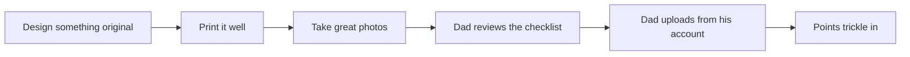

# Contests & Community: The Family Playbook

Everything we need to enter contests, publish models, and earn rewards on MakerWorld and Printables this summer — with honest notes about which dates and numbers are solid and which need a re-check in the app.

Part of the [Boaky Family Summer 3D Printing Program](00-overview.md).

*Weird words? Check the [Decoder Ring](10-glossary.md).*

**How to read the confidence flags:** facts came from search-result research (July 6, 2026), not always the live contest pages. **[VERIFIED]** = confirmed in multiple independent places. **[PARTIAL]** = seen once. **[CHECK IN-APP]** = re-verify on the contest page (Bambu Handy app or browser) before we anchor a week of work to it.

---

## 1. Summer 2026 contest calendar

| Contest | Platform | Closes | Confidence | Program week | Best fit | Link |
|---|---|---|---|---|---|---|
| Clog Charms (#517) | Printables | **Jul 12, 23:59 UTC** | [VERIFIED] | Week 1 (Jul 6–12) | **Matt** — tiny snap-in shoe charm, perfect 90-minute first original design | [Contest page](https://www.printables.com/contest/517-clog-charms) |
| Designer Challenge: Modular Drawer System (#516) | Printables | **Jul 22, 23:59 UTC** | [VERIFIED] | Weeks 2–3 (Jul 13–26) | **Peter** — modular stackable systems thinking; 1st prize is a Prusa MK4S kit, 2nd 1050 / 3rd 700 Prusameters | [Contest page](https://www.printables.com/contest/516-designer-challenge-modular-drawer-system) |
| Pet Feeder Design Contest (#149) | MakerWorld | **~Jul 28** ("ends in 22 days" as of Jul 5–6 crawl) | [PARTIAL — CHECK IN-APP] | Week 3 (Jul 20–26) | Either kid — 3 categories incl. Interactive & Puzzle Feeders; good functional-design practice | [Contest page](https://makerworld.com/en/contests/149) |
| BONBON Capsules Design Contest (#150) | MakerWorld | **~Aug 1** ("ends in 26 days" as of Jul 5–6 crawl) | [PARTIAL — CHECK IN-APP] | Weeks 3–4 (Jul 20–Aug 2) | **Matt** — surprise toy that fits the official 2.7-inch capsule; a printable "capsule checker" verifies fit (if the lid won't close, it doesn't qualify) | [Contest page](https://makerworld.com/en/contests/150) |
| Exoskeleton & Articulated Mechanism Challenge (host @MeshBear) | MakerWorld | Started **Jul 6** [VERIFIED]; end date unknown — creator contests typically run ~4–6 weeks, so likely early-to-mid Aug | [CHECK IN-APP] | Weeks 5–7 (if it runs into Aug) | **Matt** — articulated/mechanical designs, straight out of his Week 6 joints work | [Contests hub](https://makerworld.com/en/contests) |
| PlayGrid Board Games Design Contest (host @ozarkexpeditions) | MakerWorld | Date shown **Jul 22** — but start-vs-end is **ambiguous**. If it *starts* Jul 22, it likely closes late Aug and is a great capstone target; if it *ends* Jul 22, skip it | [CHECK IN-APP — do not plan around it until confirmed] | Weeks 5–8 (only if Jul 22 is the start) | **Both** — Peter: city-grid games; Matt: tabletop games. Free web PlayGrid Designer tool for prototyping | [PlayGrid project](https://makerworld.com/en/crowdfunding/194-playgrid-modular-board-game-experience) |

Not on the list, on purpose:

- **Open Sauce Spinning Battle Tops (#513)** closes Jul 8 — perfect Matt theme, but two days into the program is too soon. Battle tops stay in the idea bank for fun anyway.
- **Sensory Play (#506)** already ended (ran Mar 6–22, 2026). Ignore any older notes that mention it.
- **Exoskeleton prizes:** a "$400 gift card + TRYX products" prize list surfaced in research, but it very likely belongs to the older TRYX contest (#118). Treat Exoskeleton prizes as unknown until we read the page.

**Family deadline rule:** MakerWorld end-*times* are notoriously unclear (dates list as 00:00 UTC and the community regularly gets burned). **We submit at least a full day before the listed end date, every time.** Printables is explicit — **23:59 UTC** on the closing date — but the buffer rule applies there too, because contest-eve printer problems are a law of nature.

---

## 2. Contest entry rules that matter

MakerWorld ([official rules page](https://makerworld.com/en/contests/rules)) — all [VERIFIED]:

- **Max 5 entries** per contestant per contest.
- **Original work only.** No reposting models from other sites; MakerWorld can demand proof you designed it. (Also: no Mario. Nintendo actively takes down Mario models — Matt designs "inspired-by" originals instead.)
- **Photos required, preferably of the actual printed model.** Renders — computer preview pictures, not real photos — are weaker on their own. Plan a photo session for every entry.
- Must be **printable on an FDM printer** (a normal filament printer like ours — our H2C qualifies easily).
- **Stay on theme.** Off-theme entries get disqualified; repeat offenses can bar you from future contests.
- Entries must stay posted through the review period; **winning models must stay on MakerWorld at least one year** — so don't enter anything we might want to take down.
- Judging favors unique, eye-catching, high-quality, original models — exactly what Sections 4 and 5 below optimize for.

Printables:

- Deadlines are explicit: **23:59 UTC on the closing date**, stated on every contest page ([contest hub](https://www.printables.com/contest)).

---

## 3. Accounts & ages (why everything publishes from Dad)

Verified from the [MakerWorld Terms of Use](https://makerworld.com/en/user-agreement) and creator-program agreements:

- MakerWorld accounts require **age 13+**; users 13–17 need a **legal guardian to review and accept the Terms** (the Terms of Use are the site's rulebook you agree to) on their behalf.
- The monetized programs — the ones that pay actual money — require **18+** (age of majority). That covers the [Exclusive Model Program](https://makerworld.com/en/exclusive-model-policy) ("exclusive" = the model is published only on MakerWorld, nowhere else) and [Commercial Membership](https://makerworld.com/en/commercial-license-membership-agreement), plus Crowdfunding.

So our structure:

- **Everything publishes from Dad's account.** It satisfies the 18+ creator-program rules, keeps all points in one redeemable pool, and puts an adult behind any prize acceptance.
- Kids are **credited by first name in every model description** ("Designed by Peter, age 13"). Their design work is theirs; the account is Dad's.
- **Peter (13) may have his own browsing account** with Dad's guardian consent (Dad officially says yes to the site's rulebook for him) — for following creators, saving models, and rating profiles. He does not publish from it.
- **Matt (10) has no account.** He browses over Dad's shoulder and his designs go up under Dad's account like everyone else's.

---

## 4. Points, honestly

### The 2026 MakerWorld overhaul — what changed

MakerWorld rebuilt its points system in 2026 to stop points farming and stop fast-print trinkets out-earning real work ([official announcement](https://makerworld.com/en/community/post/458727), confirmed by [Fabbaloo](https://www.fabbaloo.com/news/bambu-lab-overhauls-makerworld-points-system-to-curb-abuse-and-reward-quality)). Downloads and prints still count, but they are no longer the only yardsticks. What earns points now:

1. **Originality** — new ideas and underrepresented categories ("not just boxes and coasters"). Peter's city models and Matt's capsule toys are exactly this.
2. **Complexity** — technically impressive, structurally intricate models earn more. Articulated mechanisms, multi-part builds.
3. **Presentation** — good photos, **verified print profiles** (a print profile = your exact slicer settings, packaged so anyone can print your model with one click), clear assembly instructions, engagement.
4. **Platform recognition** — featured models and **contest winners get bonus points**.

**The catch: exact per-download point values are no longer published.** The formula is deliberately opaque ([All3DP guide](https://all3dp.com/2/makerworld-points-rewards/) confirms). **Nobody in this family gets to say "if we get X downloads we'll earn Y points" — that math does not exist anymore.** We control the four levers above, and that's what we work.

### Numbers that ARE verified

| Fact | Value | Confidence |
|---|---|---|
| A Boost from another user (a Boost is a super-like that sends the creator points) | **12 points** to the creator (15 for Exclusive models) | [VERIFIED — Bambu blog + All3DP] |
| Gift card exchange | **~500 points ≈ $40 Bambu store gift card**; Points Shop also stocks filament, accessories, MakerLab credits | [VERIFIED] |
| Exclusive models | earn **+25% points** | [PARTIAL] |
| Maker's Supply Creator Incentive | 3–15% cash commission when your model has a Bill of Materials (BOM — a parts list with buy links) and buyers use the BOM links | [VERIFIED] |

### The faster loop: Printables Prusameters

Verified from the [Prusa Knowledge Base](https://help.prusa3d.com/article/how-do-prusameters-on-printables-work_365065):

- Prusameters are Printables' version of points — earn enough and they turn into real stuff. **350 Prusameters = a free Prusament spool** (PLA/PETG/ASA) — a more kid-tangible target than the gift card.
- **Up to 10 Makes per month earn Prusameters** — uploading photos of things we printed. The kids can start earning **on day one with downloaded models**, before they've designed anything.
- New model uploads earn milestone rewards over their first 30 days.
- In every contest, the **5 entries with the most makes get 500 Prusameters each** — even without winning.
- Note: rewards ship free with Prusa orders / need a Prusa account — Dad checks US shipping terms once before we count on the spool.

### Expectations, set honestly

A brand-new small creator reaching one $40 gift card (~500 points) takes **weeks to months** — realistically, that's an end-of-summer or fall outcome, not a Week 2 one. The fastest levers we control: contest participation, original niche designs, complex builds, great photos, and verified multi-color print profiles. Printables Makes are the quick wins that keep morale up while the MakerWorld points accumulate slowly. Log the running totals in the weekly [build log](07-build-log-template.md) so progress is visible even when it's gradual.

---

## 5. Publishing checklist

What makes an upload points-eligible and contest-worthy. Sources: [MakerWorld Print Profile Upload Guidelines](https://wiki.bambulab.com/en/makerworld/tutorials/print-profile-upload) and [How to Upload Models](https://wiki.bambulab.com/en/makerworld/tutorials/how-to-upload-models).

The whole path from idea to points, at a glance:

Per upload:

- [ ] **Photos of the real print** — at least one photo of the model actually printed with the uploaded profile is required; it proves printability and boosts visibility. Renders alone are second-class.
- [ ] **A meaningful print profile.** Merely tweaking settings or rearranging placement "without clear benefits" does not qualify. Important for us: **multi-color via pause-print filament swaps explicitly does NOT qualify** — real AMS multi-color profiles (the AMS is the printer's multi-spool color changer; the colors are embedded via paint-on-model or per-object mapping) are the standard. Our H2C multi-color profiles with good photos are a direct points lever under the 2026 Presentation score.
- [ ] **A real description** — why you designed it, whether it's supportless, what filament, what it's for, how to assemble. The kids' [build log](07-build-log-template.md) entries basically ARE this text — write once, use twice.
- [ ] **Correct Original vs Remix labeling.** A remix is someone else's model that you changed, where the license allows it. Remixes must credit the original and describe what changed; minor tweaks (scaling, recoloring, adding a name) are not valid remixes and get taken down.
- [ ] **On-theme, if it's a contest entry** — re-read the contest brief before submitting.

Family review step, before Dad clicks publish:

- [ ] **No personal info** anywhere — no last name, school, address, or recognizable house/street in photos; kids credited by first name only.
- [ ] Photos checked for background clutter and anything identifying.
- [ ] Kid walks Dad through the design and description; **Dad approves and publishes.** No exceptions — it's Dad's account and Dad's name on it.
- [ ] For contest entries: submitted **at least one full day before the deadline** (Section 1 rule).

Bonus habit: rating other creators' print profiles earns small rewards too — a good Sunday show-and-tell wind-down activity.

---

## 6. Backup radar

Contests churn constantly, so if a target closes early or a date turns out wrong, there is always a replacement. Where new ones appear:

- **[MakerWorld contests hub](https://makerworld.com/en/contests)** — roughly **4–6 new contests per month** (contest IDs jumped from ~128 in Feb to 150+ by July), mixing official seasonal contests with a steady hosted-by-creator series. At any moment there are typically 2–4 live alternatives. Upcoming ones are teased under the [Upcoming Contest community tag](https://makerworld.com/en/community/tag?name=Upcoming+Contest). There is also a "Master Challenge" series (e.g. [Master Challenge: Mecha](https://makerworld.com/en/contests/63)).
- **[Printables contest hub](https://www.printables.com/contest)** — near-weekly/biweekly themed contests plus the new monthly "Designer Challenge" (Designer of the Month picks a 3-week theme). Reliable backup deadlines every 2–3 weeks, always with explicit 23:59 UTC closes.
- **Aggregators** (sites that gather contests from everywhere into one list): [3DWithUs competitions list](https://3dwithus.com/3d-printing-competitions) tracks MakerWorld/Printables/Cults contests in one place; [Cults3D contests](https://cults3d.com/en/contests) run regularly too.
- **Fall follow-on:** the [Make:able Challenge](https://www.makeablechallenge.com/) (PrintLab + Autodesk assistive-tech design challenge, Tinkercad/Fusion, printed prototype + short video) launches a new 2026 cycle — a natural next target when the summer program ends.

Weekly habit: during Sunday show-and-tell, someone checks the two hubs, confirms next week's contest deadlines in-app, and updates this doc's calendar table if a [CHECK IN-APP] date has been resolved.
