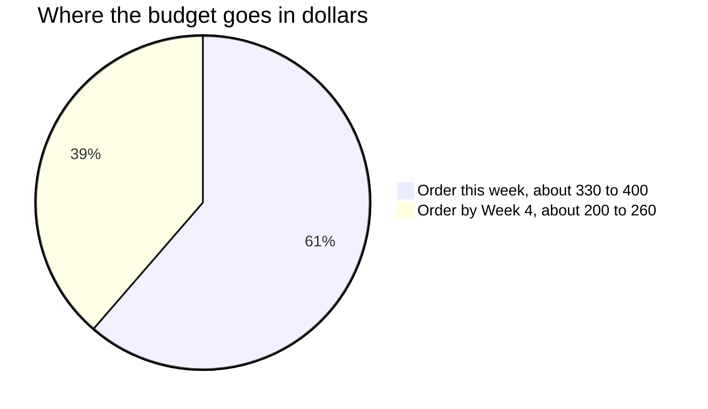

# Shopping List & Materials Plan

Everything to order for the 8 weeks — what to buy, when, and what each item unlocks. Part of the [Boaky Family Summer 3D Printing Program](00-overview.md).

*Weird words? Check the [Decoder Ring](10-glossary.md).*

**Price caveat:** Prices below were observed in July 2026 search-result data (the Bambu US store and several retailers block automated page fetches), so treat every number as approximate — **verify at checkout**. Time-sensitive: the [Bambu 4th Anniversary Sale](https://us.store.bambulab.com/pages/anniversary-sale) runs June 15 – July 15, 2026, so place the Week-1 order **before July 15** to catch sale pricing. And always batch Bambu orders: the [Filament Bulk Sale](https://us.store.bambulab.com/pages/promotions/filament-bulk-sale) gives **25% off at 4+ eligible items**, with free US shipping over $89. Never order fewer than 4 rolls at a time.

---

## 1. Order this week (Week 1 — before July 15)

Everything for Weeks 1–4: bootcamp, remix week, first original designs, and multi-color mastery.

- [ ] **PLA CMYK Lithophane Bundle** (Cyan/Magenta/Yellow/White, 4 kg) — $66–92 — [Bambu US](https://us.store.bambulab.com/products/pla-cmyk-lithophane) or [STEMfinity at $65.99 sale (reg. $91.96)](https://stemfinity.com/products/bambu-lab-pla-cmyk-lithophane-bundle). *Unlocks: Week 4 multi-color painting + the CMYK lithophane workflow. (A lithophane is a photo turned into print thickness — it glows into a picture in front of a light. CMYK is the inkjet-style color set that mixes into almost any color.) These are the exact four colors the [official Bambu CMYK guide](https://wiki.bambulab.com/en/knowledge-sharing/CMYK-color-lithophane-printing-instructions) requires, and they double as bright general-purpose colors for Matt's toys and Peter's city.*
- [ ] **PLA Basic refills ×5: Black, Gray, Red, Green, second White** — ~$75–100 ($19.99 ea; ~$15 ea with the 4+ bulk discount) — [PLA Basic](https://us.store.bambulab.com/products/pla-basic-filament). *Unlocks: everything from Week 1 on (PLA is the easy everyday plastic — 90% of what we print) — roads and concrete for Peter's city blocks, Mario-palette colors for Matt, and white is the most-consumed color in lithophane/HueForge work.*
- [ ] **Bambu Reusable Spools ×2–3** — ~$20–30 (verify; price not confirmed in research) — [Reusable spool](https://us.store.bambulab.com/products/bambu-reusable-spool). *Unlocks: using the cheaper refill pricing above.*
- [ ] **Budget third-party PLA, 2–4 kg** (SUNLU Meta or Overture, black/white) — $30–65 — [SUNLU PLA Meta ~$16/kg](https://www.amazon.com/SUNLU-Filament-Toughness-Clogging-Dimensional/dp/B0B1ZV6CJM), [Overture](https://overture3d.com/products/overture-pla). *Unlocks: high-volume weeks — Peter's city-tile prototypes and Matt's fidget iterations without burning Bambu-priced spools.*
- [ ] **HueForge Personal Use lifetime license** — $24 (reg. $30) — [HueForge shop](https://shop.thehueforge.com/products/color-lithophane-builder). *Unlocks: filament-painting projects from Week 4 on (HueForge is software that stacks super-thin color layers into a full picture). Personal is the correct tier for family use — skip the commercial tiers.*
- [ ] **6×2 mm neodymium magnets, 100 pc** (the tiny super-strong silver ones) — ~$8–15 — [MEALOS with storage case](https://www.amazon.com/MEALOS-Magnets-6mmx2mm-Miniatures-Storage/dp/B08WLT3PHD) (alt: [kkhouse](https://www.amazon.com/kkhouse-Circular-Magnets-Neodymium-Permanent/dp/B096RFNYD9), premium N52 [totalElement 150-pack](https://totalelement.com/products/6mm-x-2mm-neodymium-rare-earth-permanent-disc-magnets-n52-150-pack)). *Unlocks: Week 6 pause-at-height magnet embedding and Peter's magnetic city-tile connectors. Small parts — Dad stores these.*
- [ ] **Filament dry boxes, 4-pack with hygrometers + desiccant** (hygrometer = humidity meter; desiccant = moisture-soaking packets) — ~$30–45 — [Amazon 4-pack](https://www.amazon.com/Filament-Storage-Box-Moisture-Proof-Hygrometers/dp/B0GZMXVL7W) (alt: [Lokkr 4-pack](https://www.amazon.com/Lokkr-Filament-Storage-Box-4-Pack/dp/B0G6DCJ3S9)). *Unlocks: safe storage for the moisture-sensitive TPU and PVA arriving before Week 5. The AMS 2 Pro — the 4-spool "vending machine" that feeds the printer — has a built-in dryer, so these are mainly for storage.*
- [ ] **99% IPA (super-pure rubbing alcohol; a quart is plenty) + glue stick + spare flush cutter (snips supports flush to the surface) + deburring tool (shaves sharp edges off prints)** — ~$25–40 total — [IPA gallon 4×32 oz](https://www.amazon.com/Isopropyl-Alcohol-99-Gallon-Packed/dp/B01DGYX7HO) (bigger: [2×1-gal](https://www.amazon.com/Isopropyl-Alcohol-99-Pack-Gallons/dp/B08LHKTBH9)); cutters/deburring/glue are generic Amazon items. *Unlocks: plate cleaning and part finishing all summer. IPA and deburring tools are Dad-supervised.*

**Do NOT buy:** nozzles or hotends (a hotend = the nozzle plus its heater, one swappable unit). The H2C combo ships with **8 hotends** — 4× 0.4 mm hardened induction (induction = heats up by magnets, super fast), 1× 0.2 mm induction (that covers CMYK lithophanes), 1× 0.6 mm, 2× 0.4 mm standard — plus glue and a cleaning sponge ([H2C packing list](https://wiki.bambulab.com/en/h2c/acc-in-the-box)).

---

## 2. Order by Week 4 (in cart by end of Week 3, ~July 26)

Everything for Weeks 5–8: TPU week, support materials, effect-plate finishes, capstones. TPU and PVA are the long-lead, moisture-sensitive items — order early, store in the dry boxes.

- [ ] **TPU 95A HF, 1–2 kg** — $33–70 ($33.19/kg at 3DJake) — [Bambu US](https://us.store.bambulab.com/products/tpu-95a-hf), [3DJake black](https://www.3djake.com/bambu-lab/tpu-95a-hf-black). *TPU is the rubbery, squishy filament; 95A is the squishiness score — lower = squishier; HF means high-flow, tuned to print faster. Unlocks: Matt's Week 5 flexi/bouncy toys and the [airless soccer ball](https://makerworld.com/en/models/498713-airless-soccer-ball) (<500 g, ~35–40 h) feeding into his Week 7 tabletop soccer capstone.*
- [ ] **TPU for AMS, 1 kg** — ~$38–41 — [Bambu US](https://us.store.bambulab.com/products/tpu-for-ams), [3DJake](https://www.3djake.com/bambu-lab/tpu-for-ams). *Unlocks: PLA+TPU multi-material prints where the flexible filament rides in the AMS alongside PLA (see the H2C TPU rules below).*
- [ ] **PVA water-soluble support, 0.5 kg** (PVA = support plastic that dissolves in water) — ~$41 — [Bambu US](https://us.store.bambulab.com/products/pva), [3DJake $41.23](https://www.3djake.com/bambu-lab/pva-2). *Unlocks: the dissolvable-support mini-project — impossible overhangs, then the supports melt away in plain tap water, no chemicals ([Bambu PVA page](https://us.store.bambulab.com/products/pva)).*
- [ ] **Support for PLA (New Edition), 0.5 kg breakaway** (breakaway = supports you snap off by hand, no water bath) — ~$16–25 (verify; Bambu says "34% less cost than its predecessor") — [Bambu US](https://us.store.bambulab.com/products/support-for-pla-new). *Unlocks: everyday support work at lower cost per print than PVA — Peter's bridges and overhangs in Weeks 6–7.*
- [ ] **PLA Silk+ (1–2 colors) or Silk Multi-Color** — $25–60 (~$24.86–29/kg) — [Bambu US Silk+](https://us.store.bambulab.com/products/pla-silk-upgrade), [Silk Multi Color](https://us.store.bambulab.com/products/pla-silk-multi-color), [3DJake Silk+ Mint $24.86](https://www.3djake.com/bambu-lab/pla-silk-mint). *Silk PLA prints with a shiny, almost-metallic finish. Unlocks: showcase-grade finishes for Week 7–8 capstone and showcase pieces.*
- [ ] **PETG Basic, 2 kg** (PETG = the tough, slightly stretchy plastic for parts that get abused) — ~$40 ($20/refill; $12.99 at 10+ qty) — pricing per [ToolGuyd's 2026 relaunch coverage](https://toolguyd.com/bambu-petg-basic-3d-printing-filaments-relaunch-2026/). *Unlocks: Week 5 functional/outdoor parts. Note: PETG HF is **discontinued** ("will not be restocked" — [Bambu PETG HF page](https://us.store.bambulab.com/products/petg-hf), [Filament Cheat Sheet](https://filamentcheatsheet.com/blog/bambu-petg-hf-discontinued-what-to-use-2026/)); the reformulated PETG Basic (7 colors) is its March 2026 replacement.*
- [ ] **LED puck lights, 1 pack** — ~$15–25 — [TECOMLIGHT RGBW 6-pack with remote](https://www.amazon.com/Battery-Operated-Wireless-Lighting-Changing/dp/B09MQM8Q23) (alt: [Amazon Basics 2-pack](https://www.amazon.com/Amazon-Basics-59437-Battery-Operated/dp/B0B4SC22T4)). *Unlocks: backlighting lithophanes and glowing city buildings for Weeks 6–8 embedding projects and showcase day.*

---

## 3. Nice to have (skip unless a track catches fire)

- [ ] **TPU 90A, 1 kg** — ~$37–43 — [Bambu US](https://us.store.bambulab.com/products/tpu-85a-tpu-90a), [3DJake white $42.55](https://www.3djake.com/bambu-lab/tpu-90a-white), [MatterHackers](https://www.matterhackers.com/store/l/bambu-lab-tpu-90a-filament-175mm-1kg/sk/M62YC4L5). *Softer/squishier than 95A — only if Matt wants extra-squishy after Week 5. 95A HF + TPU for AMS cover everything in the program.*
- [ ] **H2D TPU High-Flow Kit** — [MatterHackers](https://www.matterhackers.com/store/l/bambu-lab-h2d-tpu-high-flow-kit/sk/MJDVJYGC). *Only if TPU becomes an obsession; the stock rear inlet is fine for this summer.*
- [ ] **More SUNLU/Overture bulk PLA** — [SUNLU 4 kg bundle](https://www.amazon.com/SUNLU-Filament-Printer-Tougher-Individually/dp/B0DNYWH6HQ), [Overture 10 kg bundle](https://www.amazon.com/OVERTURE-Filament-Consumables-Dimensional-Accuracy/dp/B07ZJPCQBN). *If consumption outruns the estimate mid-program.*
- [ ] **Polymaker PolyTerra/Panchroma Matte PLA, ~$18–30/kg** — [Polymaker product page](https://polymaker.com/product/polyterra-pla/), [buying guide](https://3dprintgeek.com/blog/where-to-buy-polymaker-polyterra-pla-cheapest-price). *Polymaker has the most complete pre-calibrated HueForge TD library (TD = a score for how much light a filament lets through — HueForge needs it) — nice for serious filament painting.*
- [ ] **Dedicated lithophane light bases** — [ItsLitho light sources](https://itslitho.com/product-category/lithophane-light-sources/). *Fancier than puck lights for showcase gifts.*
- [ ] **PLA Basic Starter Classic Pack** (Green/White/Gray/Black) — [Bambu US](https://us.store.bambulab.com/products/pla-basic-beginner-s-filament-pack) — reliable price not surfaced in research; the individual refills above cover the same colors.

---

## 4. What unlocks what — week by week

Quick cross-check so nothing arrives late. Tier 1 = "order this week," Tier 2 = "order by Week 4."

| Week | Activity | Needs (tier) |
|---|---|---|
| 1 (Jul 6–12) | Bootcamp, Clog Charms contest, first Tinkercad design | PLA Basic colors, IPA, glue, cutters (all Tier 1) |
| 2 (Jul 13–19) | Remix week — city blocks (Peter), flexi toys (Matt) | PLA + budget third-party PLA for iteration (Tier 1) |
| 3 (Jul 20–26) | Original design I, drawer/pet-feeder contests | Same PLA stock; TD step test if HueForge arrived (Tier 1) |
| 4 (Jul 27–Aug 2) | Multi-color mastery, purge science, BONBON capsules | CMYK bundle, HueForge license (Tier 1) |
| 5 (Aug 3–9) | TPU week (Matt), PETG functional parts, Fusion 360 (Peter) | TPU 95A HF, TPU for AMS, PETG Basic (Tier 2) |
| 6 (Aug 10–16) | City data (Peter), joints (Matt), magnet embedding (family) | Magnets (Tier 1), PVA + breakaway support (Tier 2) |
| 7 (Aug 17–23) | Capstones — city district, tabletop soccer | Remaining TPU, Silk+ for finish parts (Tier 2) |
| 8 (Aug 24–30) | Finish + showcase, publish to MakerWorld | LED puck lights for the display table (Tier 2) |

---

## 5. Filament plan

**How much the summer eats (estimate, from project weights + purge overhead):** a dad + two kids printing most days on an H2C runs roughly **1.5–2 kg/week ≈ 12–16 kg over 8 weeks**, PLA-dominant, plus 1–2 kg TPU and 0.5 kg of each support material. Multi-color AMS jobs at kid-default settings carry **25–40% purge overhead** (purge = the plastic wasted at every color switch) — flush volumes (how much gets purged per swap) can typically be cut up to 50% from defaults, and "flush into infill" helps ([Micro Center waste guide](https://www.microcenter.com/site/mc-news/article/reduce-multifilament-waste.aspx)). Week 4's purge-science session pays for itself.

**First 8 color slots (AMS 2 Pro holds 4; rotate):**

| Slot | Color | Why |
|---|---|---|
| 1–4 | Cyan #0086D6, Magenta #EC008C, Yellow #F4EE2A, Jade White | Official CMYK lithophane set ([Bambu Wiki guide](https://wiki.bambulab.com/en/knowledge-sharing/CMYK-color-lithophane-printing-instructions)); double as bright toy/city colors |
| 5 | Black PLA Basic | Outlines, Peter's roads, HueForge shading |
| 6 | Gray PLA Basic or Matte | Buildings and concrete for city models |
| 7 | Red PLA Basic | Mario-inspired palettes, soccer accents |
| 8 | Green PLA Basic | Parks and trees, character colors |

A second white is deliberate — white is the most-consumed color in HueForge and lithophane work.

**TPU on the H2C — read before ordering (the one gotcha in this list):** standard **TPU 95A HF / 90A cannot go through the AMS**. On H2-series printers it feeds via the **dedicated TPU inlet on the back** (external spool); recent firmware also supports the TPU High-Flow Kit and Feed Assist Module ([Bambu Wiki H2 TPU printing guide](https://wiki.bambulab.com/en/h2/h2d-tpu-printing-guide), [TPU printing guide](https://wiki.bambulab.com/en/knowledge-sharing/tpu-printing-guide), [forum setup thread](https://forum.bambulab.com/t/tpu-95a-hf-on-h2d-correct-filament-setup-and-inlet/231906)). Only the harder **"TPU for AMS"** (55D-class) is AMS-loadable. So buy both: 95A HF for the soccer ball via the rear inlet, TPU for AMS for PLA+TPU combo prints. Dry TPU 95A HF ~8 h at 70 °C before printing ([3DJake product notes](https://www.3djake.com/bambu-lab/tpu-95a-hf-black)) — the AMS 2 Pro's built-in dryer can do it.

**Bambu vs third-party strategy:** Bambu brand for multicolor/RFID convenience (RFID = the name-tag chip in Bambu spools the printer reads automatically) and specialty materials (TPU, PVA, Silk, CMYK); SUNLU/Overture at $14–18/kg for high-volume basics. Third-party caveats: **cardboard spools fray and jam the AMS** — print free spool-edge adapters or buy plastic-spooled brands (SUNLU Meta and Overture ship on plastic), and odd-diameter spools may need printable peg adapters ([ADP Industries AMS guide](https://www.adpindustries.com/blog/bambu-lab-ams-troubleshooting-guide/)). No RFID means you select the filament profile manually in Bambu Studio — routine, not a problem ([Envirolaser AMS guide](https://www.envirolaser3d.com/blogs/news-and-insights/bambu-lab-ams-setup-troubleshooting-guide), [Bambu forum thread](https://forum.bambulab.com/t/question-regarding-the-rfid-information-and-3rd-party-filaments/23620)); enthusiasts can print the [Universal RFID Spool Adapter](https://makerworld.com/en/models/841663-universal-rfid-spool-adapter-for-ams).

---

## 6. Tools & consumables (verified list)

| Item | Status | Notes |
|---|---|---|
| Hotends/nozzles (incl. 0.2 mm for lithophanes) | **In the H2C box — do not buy** | 8 hotends included ([packing list](https://wiki.bambulab.com/en/h2c/acc-in-the-box)) |
| Flush cutters, deburring tool, glue stick | Buy spares (~$15–25) | Box includes basics + glue; spares mean no fighting over tools. Deburring = Dad-supervised |
| 99% IPA | Buy 1 quart (~$10–15) | Plate cleaning; plenty for 8 weeks |
| Dry boxes + hygrometers + desiccant | Buy 4-pack (~$30–45) | For TPU/PVA storage; AMS 2 Pro dries, boxes store |
| 6×2 mm neodymium magnets | Buy 100 pc (~$8–15) | Week 6 embedding + city tiles; small parts, Dad stores |
| LED puck lights | Buy 1 pack (~$15–25) | Lithophane/city backlighting for showcase |
| HueForge Personal license | Buy ($24–30) | Software, not a consumable, but it lives on this list so it gets ordered |

---

## 7. Running budget

| Tier | When | Est. total |
|---|---|---|
| Order this week (Week 1) | Before July 15 (anniversary sale) | **$330–400** |
| Order by Week 4 | In cart by end of Week 3 | **$200–260** |
| Nice to have | Only if a track catches fire | $0 (skippable) — TPU 90A ~$40, kits/bulk extra |
| **8-week program total** | | **~$530–660** (≈17–19 kg filament + software + accessories) |

How the budget splits between the two real orders (using the middle of each range — the "nice to have" tier is $0 unless a track catches fire):

**If Dad wants to trim ~$100:**

- Skip TPU 90A entirely — 95A HF + TPU for AMS cover every program activity.
- Use breakaway Support for PLA instead of PVA (roughly halves support cost).
- Buy all high-volume PLA as SUNLU/Overture at $14–18/kg instead of Bambu-brand.
- Time both Bambu orders to hit the 4+-item 25% bulk discount and the $89 free-shipping threshold.

**Order batching cheat sheet:**

- Bambu order #1 (this week, before July 15): CMYK bundle + 5 PLA refills + reusable spools — well past 4 items, so the 25% bulk discount and anniversary-sale pricing both apply.
- Amazon order (this week): magnets, dry boxes, IPA, cutters/deburring/glue, third-party PLA.
- HueForge (this week): license is a download, no shipping — but buy while the $24 sale price holds.
- Bambu order #2 (end of Week 3): TPU 95A HF + TPU for AMS + PVA + Support for PLA + Silk+ + PETG Basic — again 4+ items, again 25% off. Move TPU and PVA straight into dry boxes on arrival.

**Reminder:** all prices here come from search-result data observed in early July 2026, not live cart checks — confirm at checkout, and grab the Bambu newsletter coupon (up to $20 US, per the [anniversary sale page](https://us.store.bambulab.com/pages/anniversary-sale)) before the first order.
