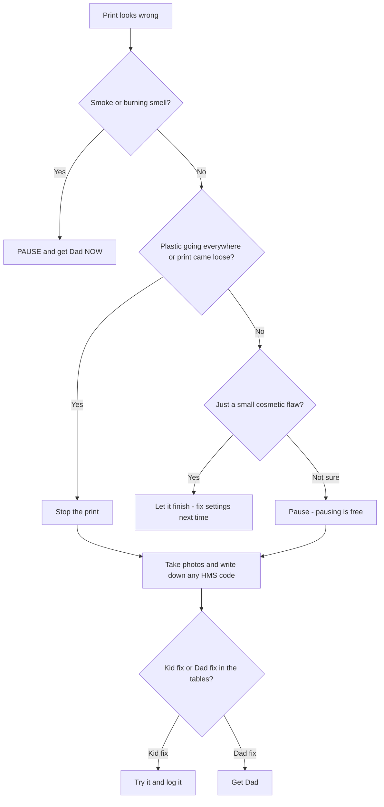

# Troubleshooting: The Family Failure Playbook

When a print goes wrong, this doc tells you what it's called, whether it's a kid fix or a Dad fix, and where the official guide lives.
Part of the [Boaky Family Summer 3D Printing Program](00-overview.md).

*Weird words? Check the [Decoder Ring](10-glossary.md).*

Failed prints are not disasters — they are lessons you can hold in your hand. Name the failure, log it in the [build log](07-build-log-template.md), fix it, and you just leveled up. When you paste a symptom to Claude, use the bold names from the tables below (e.g. "we have **stringing**" — thin cobweb hairs on the print — or "the printer says **spaghetti detected**" — the print came loose and turned into a noodle pile). That gets you a better answer faster.

Bookmark these two pages; they are the family's first stop for anything not covered here:

- Master index: [Common print quality problems and solutions (Bambu Wiki)](https://wiki.bambulab.com/en/knowledge-sharing/common-print-quality-problem)
- Any error code on the screen (the printer calls these **HMS codes** — every code has a meaning and a fix): [HMS error-code lookup](https://wiki.bambulab.com/en/hms/home)
- H2C-specific hub: [H2 Series Troubleshooting](https://wiki.bambulab.com/en/h2/troubleshooting) and [H2C FAQs](https://wiki.bambulab.com/en/h2c/manual/h2c-faq)

---

## 1. First, don't panic — the 60-second triage

The whole drill in one picture (details in the numbered steps below):

1. **Is anything unsafe?** Smoke, burning smell, or filament smeared on the hot nozzle growing into a blob? Hit **pause** and get Dad immediately. (The H2C has flame sensors and an emergency stop, but a human beats a sensor.)
2. **Decide: stop or let it ride?**
   - Print detached from the plate, spaghetti everywhere, or the nozzle is dragging a blob → **stop the print.** Continuing wastes filament and can jam the nozzle.
   - Small cosmetic flaw (a little stringing, one rough layer) → usually fine to **let it finish**, then fix settings for next time.
   - Not sure → pause (pausing is free) and ask Dad or Claude.
3. **Photograph the failure before you touch anything.** Take one wide shot and one close-up. This goes in the build log and is what you describe to Claude ("here's what we saw"). If the printer showed an HMS code, write the full code down — you can look it up at the [HMS home page](https://wiki.bambulab.com/en/hms/home).
4. **Hands out of the chamber.** Nozzles run up to 350 C and the chamber heats to 65 C — hot even after the print ends. Wait for cooldown; prints self-release from a cooled plate anyway.
5. **Match the symptom** in the tables below. If it has a photo-matching problem, the [All3DP 30-problems gallery](https://all3dp.com/1/common-3d-printing-problems-troubleshooting-3d-printer-issues/) lets you visually match "our print looks like THAT."

Rule of three (from every troubleshooting guide ever): most failures come down to **bed adhesion** (how well the print sticks to the plate), **temperature (including moisture), or speed**. Start there.

---

## 2. Symptom → fix

"Kid fix" = you can do it yourself. "Dad fix" = tools, disassembly, or hot-part handling — standing rule: get Dad.

### Print quality failures

| Symptom (say this to Claude) | What it looks like | Likeliest cause | Kid fix | Dad fix | Guide |
|---|---|---|---|---|---|
| **First layer not sticking / bad adhesion** | Corners peel up, print slides around, or first layer is lacy | Oily plate, or the plate type selected in Bambu Studio doesn't match the real plate (each plate has different temps and Z-offset — the nozzle's starting height above the plate) | Wash plate with dish soap + warm water; check the plate dropdown in Studio matches what's installed; glue stick for PETG | Clean the nozzle tip, then run bed-leveling calibration | [First Layer Not Sticking](https://wiki.bambulab.com/en/knowledge-sharing/first-layer-not-sticking); [first-layer test print](https://wiki.bambulab.com/en/knowledge-sharing/identify-and-fix-first-layer-issues-with-a-test-print) |
| **Stringing / oozing** | Fine hairs or cobwebs between parts | Wet filament, nozzle too hot, long travels between parts | Dry the filament (AMS 2 Pro drying); pack models closer on the plate; turn on "Avoid crossing wall" | Lower nozzle temp 5–10 C; check retraction — how far the printer pulls filament back between moves — is ≤ 2 mm (higher causes clogs) | [Stringing and oozing](https://wiki.bambulab.com/en/filament-acc/filament/print-quality/stringing-oozing); [deep-dive](https://adpindustries.com/blog/bambu-lab-stringing-fix-guide/); [PETG/TPU version](https://www.call-3d.com/blogs/upgrades/fixing-petg-amp-tpu-stringing-on-bambu-lab-3d-printers-a-complete-guide) |
| **Wet filament** | **Popping/crackling sounds from the nozzle**, bubbles at the nozzle tip, rough surfaces, stubborn stringing, brittle filament | Moisture in the filament turning to steam in the nozzle | Stop and dry the spool (see Filament care below) | — | [Wet filament symptoms (Siraya Tech)](https://siraya.tech/blogs/news/wet-filament-symptoms-causes-and-solutions); [Polymaker wiki](https://wiki.polymaker.com/printing-tips/common-printing-issues/wet-filament) |
| **Spaghetti** | Print detached; a noodle-mess of filament in the chamber; printer may alert "possible spaghetti defects detected" | Print came off the plate mid-print (adhesion failure upstream) | Check the camera. Real spaghetti: stop, clean the plate, fix adhesion. Print looks fine: it's a false alarm — resume | If false alarms repeat on one file, lower AI sensitivity for that file only | [Spaghetti detection](https://wiki.bambulab.com/en/knowledge-sharing/Spaghetti_detection); [HMS spaghetti code](https://wiki.bambulab.com/en/h2/troubleshooting/hmscode/0C00_0300_0003_0008) |
| **Layer shift** | Upper layers slid sideways; the print looks like a staircase | Nozzle collided with a warped or blobby spot; sticky PETG buildup on the nozzle; axis obstruction | Turn on "Auto-recovery from step loss"; dry the filament; enable the prime tower (the sacrificial wipe block beside your print) for PETG | Check X/Y axes for debris or obstructions | [Layer Shift: Causes and Solutions](https://wiki.bambulab.com/en/knowledge-sharing/layer-shifts) |
| **Clog / under-extrusion** | Nothing coming out, or thin gappy lines | Clog in the nozzle or the extruder (the motor wheels that push filament in) | **Cutter test** (H2C skill): at room temp, press the cutter handle to cut, then pull the filament up by hand. Pulls out smoothly → nozzle clog, proceed. Heavy resistance → **extruder clog: STOP pulling** (forcing jams it deeper) and get Dad | Nozzle clog: cold pulls — pulling cooled filament out so the gunk comes with it — until the tip comes out smooth with no burnt specks; needle from the toolkit. Extruder clog: Dad follows the extruder guide | [H2C Clog Inspection](https://wiki.bambulab.com/en/h2c/troubleshooting/clogging); [nozzle unclogging](https://wiki.bambulab.com/en/h2c/troubleshooting/unclogging); [extruder cleaning](https://wiki.bambulab.com/en/h2c/troubleshooting/extruder-cleaning-guide); [cold pull](https://wiki.bambulab.com/en/h2c/maintenance/nozzle-cold-pull-maintenance-and-cleaning) |
| **Nozzle clumping** | AI alert: a lump of filament fully encasing the nozzle | Ooze collected on the nozzle, often after adhesion failure | Pause and look via camera; if there's a real blob, get Dad | Remove the blob once cooled; never pick at a hot nozzle | [Intelligent Detection intro](https://wiki.bambulab.com/en/h2/manual/intelligent-detection); code [HMS_0C00-0300-0002-000E](https://wiki.bambulab.com/en/h2/troubleshooting/hmscode/0C00_0300_0002_000E) |
| **Elephant's foot** | Bottom layers bulge out wider than the rest | First layer squished too close / bed too hot | Lower bed temp 5 C; add a chamfer (a small slanted edge) to the bottom of your own designs (design lesson!) | Recalibrate first layer | [Bad print quality index](https://wiki.bambulab.com/en/knowledge-sharing/troubleshooting-printing-issues) |

### AMS and filament-path failures

Reminder: the AMS is the box that holds 4 spools and feeds the printer whichever filament it asks for.

| Symptom | What it looks like | Likeliest cause | Kid fix | Dad fix | Guide |
|---|---|---|---|---|---|
| **AMS loading/unloading failure** | AMS can't feed or retract filament | Stuck spool, tangle, debris in the feed path | Check the spool spins freely in its slot; look for a kinked PTFE tube (the thin guide tube the filament rides through) | Follow the wiki loading-failure steps | [AMS loading & unloading failure](https://wiki.bambulab.com/en/ams/troubleshooting/ams-loading-unloading-failure) |
| **Can't pull back filament** (HMS_0700-7000-0002-0004) | "Failed to pull back the filament from the toolhead to AMS" | Spool not rotating (or slower than the hub unloads), sharply bent PTFE tube, debris in the AMS internal hub | Check the spool isn't stuck or tangled | Unkink/re-route the tube; clean the AMS hub; if only ONE slot fails, that slot's first-stage feeder is the suspect | [HMS code page](https://wiki.bambulab.com/en/x1/troubleshooting/hmscode/0700_7000_0002_0004); [cannot pull back filament](https://wiki.bambulab.com/en/x1/troubleshooting/cannot-pull-back-filament) |
| **Filament snapped inside the AMS** | Broken stub of filament lost in the AMS | Brittle (wet/old) filament | Tell Dad which slot | Follow the broken-filament removal + hub sensor check procedure | [AMS 2 Pro broken filament removal](https://wiki.bambulab.com/en/ams-2-pro/remove-broken-stuck-material) |
| **Tangle warning** | AMS reports a filament tangle | Loose winding on the spool | **Never ignore it.** Pause and get Dad — a tangle pulled into the feed path can jam the first-stage feeder and require AMS disassembly | Rewind/fix the spool before resuming | [ADP AMS troubleshooting guide](https://www.adpindustries.com/blog/bambu-lab-ams-troubleshooting-guide/) |
| **TPU jammed in AMS** | Flexible filament wedged in the feed path | Someone put TPU through the AMS (see AMS rules — never) | Get Dad | Clearing it can require full AMS disassembly | [TPU printing guide](https://wiki.bambulab.com/en/knowledge-sharing/tpu-printing-guide) |

---

## 3. H2C-specific quirks (Vortek tool-changer)

The Vortek rack is our printer's tool-belt of 6 spare hotends (a hotend is the nozzle plus its heater, one swappable unit). This rack plus the fixed left nozzle is new tech (launched Jan 2026) and has known quirks. Reviews are broadly positive on reliability, and there is no recall — Tom's Hardware just cautions the Vortek system may be "TOO complex" ([review](https://www.tomshardware.com/3d-printing/bambu-lab-h2c-review)). Community-compiled known-issues list: [Printer Hub H2C known issues](https://printer-hub.ru/en/posts/bambu-lab-h2c-known-issues).

- **"No hotend detected" mid-swap.** Debris on the heatsink mating surface (even a thin filament film), a damaged magnet, or a worn latch blocks detection. Fix: wipe the hotend heatsink mating face with a lint-free cloth + IPA (rubbing alcohol). This wipe is one of our two H2C "owner skills" (the other is the cutter test above). Dad handles hotend removal.
- **Hotend authentication failed — HMS_0500_0500_0001_0020.** Each induction hotend has an auth chip; dirty contacts or a not-fully-seated hotend trigger it. Fix: put the hotend back on the rack and let the printer re-grab it, or reseat until the latch locks. [Wiki page](https://wiki.bambulab.com/en/h2c/troubleshooting/hmscode/0500_0500_0001_0020)
- **Hotend rack calibration failure — HMS_1A00-1200-0002-0001** ("camera calibration data abnormal"). Clean nozzle residue, check the heatbed thermal paper is intact, remove debris. Only run rack calibration **after the chamber is above 35 C**. [Wiki page](https://wiki.bambulab.com/en/h2c/troubleshooting/hmscode/1A00_1200_0002_0001); [owner thread](https://forum.bambulab.com/t/h2c-hotend-rack-calibration-failed/210019)
- **Nozzle-offset / left-nozzle calibration failures.** Firmware (the printer's built-in software) improved success rates (~April 2026), but ooze while the nozzle heats can still spoil calibration. [Forum thread](https://forum.bambulab.com/t/nozzle-offset-calibration-failed-h2c/247581); [fix guide](https://www.adpindustries.com/blog/bambu-lab-h2c-nozzle-offset-calibration-fix/)
- **Nozzle needs a wipe on Vortek changes — worst with PETG** (the tough, slightly stretchy plastic — it's extra sticky when molten). The auto-wipe isn't 100% reliable after long pauses (the nozzle oozes before wiping). On long PETG prints, some owners pause to pick debris off the nozzle. Watch for this during PETG week. [Owner thread](https://forum.bambulab.com/t/h2c-needs-a-wipe-on-every-vortek-nozzle-change/226138)
- **Excess purging even when the right colors are loaded** (purging = squeezing out waste plastic on color changes) — known open issue. [Thread](https://forum.bambulab.com/t/h2c-still-purges-eventhough-proper-colors-are-already-loaded-help/229850)
- **Refuses to load filament mid-change with no actual clog.** [Thread](https://forum.bambulab.com/t/h2c-doesnt-attempt-to-load-filament-even-though-there-is-no-clog/226879)
- **Wrong filament / mapping confusion.** The printer sometimes maps a filament to an unexpected hotend. You can pin a hotend per filament via the hotend icon on the mapping screen; if Studio and the printer disagree, resync. [Thread 1](https://forum.bambulab.com/t/my-new-h2c-sometimes-uses-the-wrong-filament/217900); [manual mapping thread](https://forum.bambulab.com/t/manual-mapping-for-filament-to-hotend-allocation/241156)
- **Right-hotend filament-calibration menu goes inactive** (no confirmed fix): [thread](https://forum.bambulab.com/t/h2c-filament-calibration/214352); general mega-thread: [H2 issues](https://forum.bambulab.com/t/h2-issues/221171). Mixing standard + high-flow hotends has quirks too: [thread](https://forum.bambulab.com/t/h2c-vortek-with-standard-and-high-flow-hotend-problem/227741)
- **Chamber temperature too high — HMS_0300-A100-0001-0001.** Open the top cover/front door to cool. Very relevant in a hot July garage. [Wiki page](https://wiki.bambulab.com/en/h2/troubleshooting/hmscode/0300_A100_0001_0001)

### Firmware notes (check we're current)

- [H2C firmware release history](https://wiki.bambulab.com/en/h2c/manual/h2c-firmware-release-history) | [download page](https://bambulab.com/en-us/support/firmware-download/h2c)
- **01.02.00.00 (June 15, 2026)** added: remote AMS 2 Pro / AMS HT drying control from Studio/Handy, **print-while-drying**, TPU on the left nozzle for higher-hardness TPU, better build-plate offset detection, faster filament changes (retraction to the Filament Track Switcher), and Filament Switching Adapter support. [Forum discussion](https://forum.bambulab.com/t/h2c-firmware-1-2-0-mentioned-in-bambu-studio-2-6-0-and-2-6-1-beta-release-notes/251520), [update thread](https://forum.bambulab.com/t/firmware-update-for-h2c/246015)
- Fixed by firmware so far: left-nozzle calibration failure rate, left-nozzle-only slicing bug, TPU-on-left-nozzle restriction (partially). Still open: excess purging, wipe reliability after pauses, per-hotend "filament memory" (promised).

### AI monitoring settings (house rule)

The nozzle camera detects **nozzle clumping, air printing, and spaghetti**; AI Print Monitoring also catches purge-chute pile-up ([Intelligent Detection](https://wiki.bambulab.com/en/h2/manual/intelligent-detection)). False positives happen ([clumping thread](https://forum.bambulab.com/t/ai-nozzle-clumping-false-positives/159066), [spaghetti thread](https://forum.bambulab.com/t/experiences-with-ai-spaghetti-detection/172582)). Our settings for anything unattended: monitoring at **Medium** (Low only if one file spams false alarms), **tangle detection ON** ([intro](https://wiki.bambulab.com/en/ams-lite/manual/filament-tangle-monitoring-intro)), Auto-recovery from step loss ON, alerts set to **pause** (not just notify), and Bambu Handy (the Bambu phone app) live view on Dad's phone. Keep the nozzle camera lens clean (weekly job). Note: above 85 C near the nozzle camera, flow detection temporarily suspends — matters for high-temp filaments, not our PLA/PETG (our everyday easy plastics).

---

## 4. AMS rules

1. **TPU never goes through the AMS. Ever.** TPU is the bendy, rubbery filament, and flexible filament buckles under the hub's push force over ~1 m of PTFE tube and wedges in the internal hub — TPU 95A/85A "will almost certainly get stuck," and clearing it can mean full AMS disassembly. Use the external spool holder, or the H2C top-feed straight into a dedicated Vortek nozzle. The slicer blocks invalid configs; don't fight it. Firmware 1.02+ allows higher-hardness TPU on the left nozzle only. ([ADP AMS guide](https://www.adpindustries.com/blog/bambu-lab-ams-troubleshooting-guide/), [Siraya TPU-on-AMS](https://siraya.tech/blogs/news/how-to-print-tpu-on-bambu-lab-ams), [official TPU guide](https://wiki.bambulab.com/en/knowledge-sharing/tpu-printing-guide))
2. **Never ignore a tangle warning.** Pause, fix the spool, then resume. A tangle pulled into the feed path = jammed first-stage feeder = Dad disassembling the AMS.
3. **Bambu spools carry RFID tags** — the AMS auto-identifies Bambu filament type and color. Third-party spools need the type set manually in Studio; getting it wrong means wrong temps, so double-check the slot settings when loading non-Bambu filament.
4. Keep the AMS closed. It is also our dry box — every open lid is humidity coming in.
5. If a slot misbehaves repeatedly while others work, note WHICH slot — that points to the slot's feeder (see the pull-back table entry above).

---

## 5. Filament care (moisture is the hidden villain)

Wet filament is the single most common hidden cause of failures. The diagnosis is free: **listen.** Popping/crackling at the nozzle = steam = wet filament ([Siraya Tech guide](https://siraya.tech/blogs/news/wet-filament-symptoms-causes-and-solutions)).

Drying quick-reference (the AMS 2 Pro dries built-in, up to 65 C; an AMS HT — if we add one — goes to 85 C; both can now dry **while printing** and be started remotely from Studio/Handy as of firmware 1.02):

| Filament | Dry at | Notes |
|---|---|---|
| PLA | max 55 C | Softens ~64 C — hotter fuses the spool into a brick |
| PETG | 65 C / 7 h | Absorbs moisture fast; one humid night can matter |
| TPU | 70 C / 7 h | Always dry, even fresh from the bag ([Overture guide](https://overture3d.com/blogs/blogs/tpu-drying-temperature-guide)) |
| PVA | before every use | The dissolves-in-water support plastic. Extremely hygroscopic (soaks up water like a sponge); store < 20% RH (relative humidity) with desiccant ([PVA guide](https://wiki.bambulab.com/en/filament-acc/filament/pva-printing-guide)) |

Storage rules ([official drying recommendations](https://wiki.bambulab.com/en/filament-acc/filament/dry-filament)):

- [ ] Spools not in the AMS live in sealed containers/bags with desiccant (the moisture-soaking beads), immediately after use
- [ ] Cheap hygrometer (humidity meter) in the filament bin — the kids' "science station"; log the RH weekly
- [ ] AMS desiccant checked and swapped when the color indicator shows saturation (~every 4–6 weeks)
- [ ] PVA is the drama queen: sealed dry box under 20% RH, calcium chloride desiccant preferred

---

## 6. Maintenance calendar

Weekly pit-crew jobs rotate between the boys: one is "plate captain," the other "filament captain," swap each Monday.

### Weekly (kid jobs, ~15 min)

- [ ] Wash the build plate with dish soap + warm water; water-film test (water beads = still dirty, sheets = clean). Quick wipes between washes: 99% IPA only — **never acetone** on PEI (the plate's textured coating), handle the plate by its edges ([PEI plate cleaning guide](https://wiki.bambulab.com/en/filament-acc/acc/pei-plate-clean-guide))
- [ ] Brush filament buildup off nozzle tips with the brass brush (printer cold, Dad watching for the Vortek rack)
- [ ] Wipe the nozzle camera lens (keeps AI detection honest)
- [ ] Check the hygrometer; re-seal any spools left out
- [ ] Empty the purge chute and clean stray purge poop from the chamber

### Monthly (kid + Dad together)

- [ ] AMS desiccant color check; swap if saturated
- [ ] Clear filament dust/shavings from the AMS feeder wheels ([AMS 2 Pro maintenance](https://wiki.bambulab.com/en/ams-2-pro/maintenance/basic-maintenance))
- [ ] Cold-pull maintenance on the workhorse hotends until the pulled tip is smooth, no burnt specks ([cold pull guide](https://wiki.bambulab.com/en/h2c/maintenance/nozzle-cold-pull-maintenance-and-cleaning))
- [ ] Check firmware and Bambu Studio for updates

### Monthly/quarterly (Dad only)

- [ ] Rail lubrication and full mechanical checkover per the community schedule ([ADP maintenance schedule](https://www.adpindustries.com/blog/bambu-lab-maintenance-schedule/))
- [ ] IPA wipe of hotend heatsink mating faces and auth contacts (prevents the detection/authentication errors in section 3)
- [ ] First-layer calibration check if adhesion has been drifting ([ADP first-layer guide](https://www.adpindustries.com/blog/bambu-lab-first-layer-calibration-guide/))

Print and laminate a cheat sheet for the wall: the [Makers Empire kid-friendly flowcharts + poster](https://www.makersempire.com/3d-printer-problems-flowchart-poster/) plus a compact one like the [3D Tech Valley printable](https://www.3dtechvalley.com/troubleshooting-3d-printing/) or [filamentcheatsheet.com](https://filamentcheatsheet.com/troubleshooting/). Picture-first galleries for symptom matching: [Simplify3D](https://www.simplify3d.com/resources/print-quality-troubleshooting/), [MatterHackers](https://www.matterhackers.com/articles/3d-printer-troubleshooting-guide).

---

## 7. Safety box

- **Hot parts.** Nozzles reach 350 C; the chamber is actively heated to 65 C and stays hot after the print ends. No hands in the chamber until cooldown. Print removal and support-trimming happen with Dad present — scraper and flush-cutter cuts are the most common real injury ([parents' guide](https://3dprinters-guide.com/3d-printer-safety-for-kids-a-parents-guide/), [STEM Lab checklist](https://stemlabguide.com/article/3d-printer-safety-checklist-for-kids)).
- **Moving gantry** (the fast-moving frame that carries the nozzle). Belts, gears, the Vortek tool-changer, and the heated bed are pinch and burn hazards. Hands off while anything moves — pause first, always.
- **Ventilation.** Even PLA gives off ultrafine particles; ABS/ASA give off much nastier VOCs (fumes). Our rules: PLA/PETG only for now, door and top cover closed while printing, room ventilated during and after prints, nobody hovers with the door open, printer not in a small bedroom ([R3 kids-safety guide](https://www.r3recs.com/guides/3d-printing-kids-safety), [U. Rochester EHS](https://www.safety.rochester.edu/ih/3Dprinters.html), [3DPrinting.com safety guide](https://3dprinting.com/safety/3d-printing-safety-guide/)). The H2C helps: fully enclosed with filtration, UL94 V-0 flame-retardant chamber materials, flame sensors, door/cover sensors, and an emergency stop ([specs](https://bambulab.com/en-us/h2c/specs)).
- **Fire and unattended prints.** Home 3D-printer fires are documented every year, and there were isolated (non-recall) H2C toolhead/AC-board incident reports in early 2026 ([Tom's Hardware coverage](https://www.tomshardware.com/3d-printing/reports-of-the-bambu-lab-3d-printer-being-a-fire-hazard-resurface-but-for-a-new-power-board-component-issue-bambu-says-the-a1s-new-issue-has-been-addressed-affected-units-replaced-or-repaired), [Consumer Rights Wiki](https://consumerrights.wiki/w/Bambu_Lab_A1_NTC_thermistor_fire_and_meltdown_hazard)). House rule: Dad approves anything unattended or overnight, monitoring stays on with Handy live view, smoke detector near the printer, and **no fully unattended prints while nobody is home**. Never unattended TPU or PVA.
- **Small parts.** 3D-printed toys can shed small pieces or snap along layer lines — keep tiny prints away from toddlers and pets ([JLC3DP toy-safety article](https://jlc3dp.com/blog/toys-safety)).
- **Repairs and disassembly = Dad. Always.** Hotend swaps off the rack, extruder clogs, AMS internals, anything with tools. Kids diagnose, photograph, and report; Dad opens things up.
