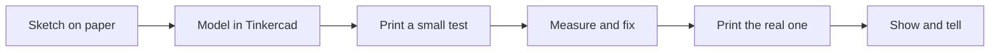
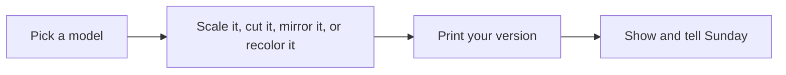

# Weekly Sparks ⚡

Fresh ideas dropped every Sunday, tuned to the program week that's starting.
Grab what excites you, ignore the rest — the [idea bank](05-idea-bank.md) is
always there too. *Weird words? [Decoder Ring](10-glossary.md).*

---

## Week 3 — Original Design I (Jul 20–26) · posted 2026-07-19

The training wheels come off: this week you design things that never existed.
The loop that makes first designs succeed:

**🏗️ Peter: the Empty Lot Project.** Find a real empty lot or parking lot near
home (walk or Street View). Design what SHOULD be built there — footprint
(the outline where it meets the ground) matched to the real lot shape. Present
it Sunday like a planning pitch: what it is, who it's for, why there. That's
called infill development, and it's half of what real planners argue about.

**🧸 Matt: the Toy With A Job.** Your first original design shouldn't just look
cool — give it a mission. What bugs you daily? Cards that won't stand up in
board games? A controller cable that tangles? Design the fix so it's ALSO fun
to fidget with. Function + fun = the designs that win contests.

**👨‍👦‍👦 Family: the Assembly Guide test.** Bambu Studio 2.8 can auto-generate
assembly instructions with exploded views (parts floating apart so you see the
stacking — see [Jul 13 discoveries](daily-discoveries.md)). Run it on the
penalty-shootout kit, then assemble following ONLY the generated guide. If the
family gets confused, the design needs work — that's a real product test.

**🤫 Gift Machine: open the secret file.** Each kid privately asks Claude for
ONE gift design idea for the other's birthday this week — practice run for the
[secret-print protocol](09-gifts-and-occasions.md). Claude keeps secrets;
QA-LOG entries stay vague.

**🍬 Early start on BONBON (closes ~Aug 1).** Matt: capsule-toy contest is next
week's main event — spend 20 minutes this week sketching 5 capsule-sized toy
ideas and circle the best one. Sketching first is what pros do.

**🎯 Wildcard: clearance check-in.** Before designing moving parts, re-run
[clearance-test](../projects/family/clearance-test.scad) in the exact filament
you'll design with — different colors and brands shift the magic number a bit.
Log the new number.

### 📅 Contest radar (next 2 weeks)

| Deadline | Contest | Fits |
|---|---|---|
| **Jul 22 (Wed!)** | PlayGrid Board Games (MakerWorld) — core module is a [free print](https://makerworld.com/en/models/2662193-playgrid-core-module) | Peter |
| **Jul 22 (Wed!)** | Modular Drawer System (Printables, 23:59 UTC) | Peter |
| **~Jul 28** | Pet Feeder (MakerWorld) — verify in-app | Either |
| **~Aug 1** | BONBON Capsules (MakerWorld) | Matt |
| **Aug 9** | Hide & Seek submissions (MakerWorld) | Family |
| **Aug 9** | Insta360 Luna Ultra Challenge — $11k prizes | Peter + Dad |

Submit a day early, from Dad's account ([playbook](04-contests-and-community.md)).

---

## Week 2 — Remix Week (Jul 13–19) · posted 2026-07-12

This week's superpower: taking models that exist and making them *yours*.
Every idea below is a remix move:

**🏙️ Peter: the Franken-city.** GreebleCity tiles and MINI-CITY buildings come
from two different creators with two different footprints (the outline where a
building meets the ground) — so they don't fit together. Design a printed
**adapter ring** in Tinkercad that lets a MINI-CITY building stand on a
GreebleCity tile. Making two systems talk to each other is real engineering,
and nobody else on MakerWorld has your adapter.

**🐉 Matt: the Chimera Lab.** Use Bambu Studio's cut tool (it slices a model in
half like a lightsaber) on two flexi animals — print the front of one and the
back of another at matching sizes, and invent your creature's name and origin
story. Legal note: remixing is allowed when the license says so — check for
"remix allowed" on the model page.

**👨‍👦‍👦 Family build: the Remix Relay.** Pick one small model. Dad scales it,
Peter cuts it, Matt recolors it — each person applies ONE remix move, printing
each stage. Line up all the stages on the shelf: that's evolution, visible.

**🎁 Gift Machine, 5-minute version: fill in the blanks.** The
[occasion calendar](09-gifts-and-occasions.md) still has blank birthday rows.
Fill them in at today's show-and-tell — takes 5 minutes, saves a December panic.

**🏛️ Wildcard: Homer's Epics contest — ⏰ ends THIS FRIDAY Jul 17.** A Greek
mythology design contest on MakerWorld. Fast-turnaround ideas: Peter, a tiny
Parthenon with real column math; Matt, an original three-headed flexi dog
(inspired by Cerberus, designed by YOU — not downloaded).
→ [makerworld.com/en/contests](https://makerworld.com/en/contests)

**🎯 Wildcard: the Seam Hunt.** While you're recoloring models this week, find
the seam (the faint line where each layer starts and stops) on every print you
own. Then move it on purpose in Bambu Studio's seam settings. Gift-quality
prints start with seam control — and now you'll never unsee it.

**⚽ Heads-up for Sunday: World Cup final is Jul 19.** If the watch-party
prints from [daily discoveries](daily-discoveries.md) are happening, slice them
by Friday so the printer isn't the one doing extra time.

### 📅 Contest radar (next 2 weeks)

| Deadline | Contest | Fits |
|---|---|---|
| **Jul 15** | Bambu anniversary sale ENDS (not a contest — the shopping list discount window) | Dad |
| **Jul 17** | Homer's Epics (MakerWorld) | Both kids, fast entries |
| **Jul 22** | PlayGrid Board Games (MakerWorld) — end date now confirmed | Peter |
| **Jul 27** | Hide & Seek challenge (MakerWorld) | Whole family |
| **~Jul 28** | Pet Feeder (MakerWorld) — verify in-app | Peter |

Reminder from the [contest playbook](04-contests-and-community.md): submit a
full day before the listed end date, from Dad's account.
