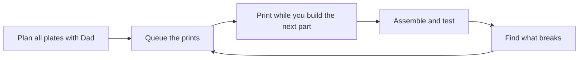
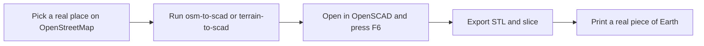
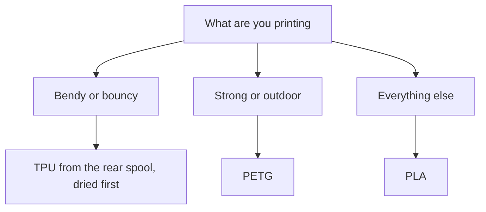
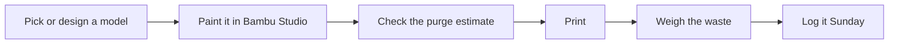
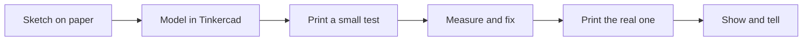
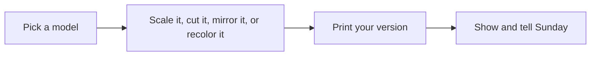

# Weekly Sparks ⚡

Fresh ideas dropped every Sunday, tuned to the program week that's starting.
Grab what excites you, ignore the rest — the [idea bank](05-idea-bank.md) is
always there too. *Weird words? [Decoder Ring](10-glossary.md).*

---

## Week 7 — Capstones (Aug 17–23) · posted 2026-08-16

Capstone week: the big builds start printing. This week isn't about new
tricks — it's about running a multi-day project like a pro. The loop:

```mermaid
flowchart LR
    A["Plan all plates with Dad"] --> B["Queue the prints"]
    B --> C["Print while you build the next part"]
    C --> D["Assemble and test"]
    D --> E["Find what breaks"]
    E --> B
```

**🏙️ Peter: give the district a museum plaque.** Real architectural models
always have one: a printed nameplate tile with the district's name, the
scale (like 1:1000 — one millimeter on the model = one meter for real), and
"designed by Peter Boaky, 2026." Design it first — naming the thing makes
the 20-plate grind feel like building a real place. Bonus: run the new
Helio simulation (see [Aug 15 discoveries](daily-discoveries.md)) on your
biggest plate BEFORE printing — a 6-hour save if it finds a warp zone.

**⚽ Matt: draft night for the Boaky Cup.** Before the stadium prints, hold
a team draft: every family member designs ONE player figure (snap-fit base,
week-6 skill) — that's a 4-player league, and everyone's invested in YOUR
capstone. Penalty-shootout from projects/ becomes the halftime mini-game.

**📋 Family build: Mission Control on the fridge.** Capstones are print-farm
week (running many plates like a tiny factory). Sticky note per plate on the
fridge: what it is, print hours, who checks it and when, moved across
"queued → printing → done → assembled" columns. That's a kanban board —
how real factories and software teams track work — and it prevents the
classic capstone fail: nobody noticed plate 7 finished at lunch.

**🎬 Wildcard: record the time-lapses NOW.** The H2C's camera can film every
plate. Turn time-lapse on for the whole capstone run — showcase day (Aug 30)
with a movie of the district growing beats photos alone, and you can't
re-film a print you already ran.

**🐛 Wildcard: Bug Off opens MONDAY.** The jumping bug from last week's
scouting is ready — enter EARLY in the week as a capstone warmup, don't let
it collide with deadline-day plate juggling.

**🎁 Gift Machine: prototype ONE teacher plaque.** Teacher gifts print next
week (last week of August). Print a single test plaque midweek — check the
name spelling, font size, and colors with fresh eyes before running the
whole batch.

### 📅 Contest radar (next 2 weeks)

| Deadline | Contest | Fits |
|---|---|---|
| **Aug 17 (Mon)** | Bug Off Design Contest OPENS (MakerWorld) | Matt's jumping bug |
| check page | Wind Spinner Design Contest (MakerWorld) | Matt |
| check page | Geared Spinners challenge (Printables) | Matt |
| **Sep 3** | Prints on the Go photo challenge closes (MakerWorld) | Family expedition |

Submit a day early, from Dad's account ([playbook](04-contests-and-community.md)).

---

## Week 6 — Real Data & Mechanisms (Aug 10–16) · posted 2026-08-09

This week the printer starts making things about the REAL world: Peter feeds
it actual map data, Matt makes parts that store energy and move. Peter's
pipeline, start to finish:

```mermaid
flowchart LR
    A["Pick a real place on OpenStreetMap"] --> B["Run osm-to-scad or terrain-to-scad"]
    B --> C["Open in OpenSCAD and press F6"]
    C --> D["Export STL and slice"]
    D --> E["Print a real piece of Earth"]
```

**🗺️ Peter: the Before-and-After block.** Print your neighborhood block TWICE:
once straight from OpenStreetMap data (OSM — the free world map anyone can
edit, like Wikipedia for maps) using `projects/peter/osm-to-scad.py`, and once
with YOUR redesign — the empty-lot building from week 3 dropped into its real
spot. Two tiles side by side is exactly how real planners present a proposal:
"here's today, here's my plan."

**🦗 Matt: the jumping bug (⏰ Bug Off contest starts Sunday Aug 17).** Mechanisms
week mission: design a flexi bug that JUMPS using a printed spring — a
compliant mechanism, which means a part that bends on purpose instead of
using a metal spring. Press down, let go, boing. Prototype it this week and
it's ready the day the contest opens — a week early instead of a day late.

**⚙️ Matt bonus: the snap-fit soccer trophy.** Practice snaps (little printed
clips that click parts together, no glue) by designing a mini trophy where
the ball, base, and name plate all snap apart — a fidget AND a prize for the
next backyard penalty shootout.

**👨‍👩‍👦‍👦 Family build: the Prints on the Go expedition.** MakerWorld's new
challenge (runs to Sep 3) wants photos of prints out in the world. Plan ONE
family outing this week: Peter prints the terrain model of a real local hill
with `terrain-to-scad.py`, everyone hikes it, and you photograph the print on
its own summit. One hike = contest entry + week-6 data lesson + memory.

**🎁 Gift Machine: caliper week for teacher gifts.** Teacher desk plaques
print in ~2 weeks (calendar says last week of August). This week: calipers
out (the pinch-to-measure tool), measure and LOCK each design — names spelled
right, sizes written down. Grandparents' hometown map bonus: the expedition
terrain print is secretly also a rehearsal for that gift.

**☀️ Wildcard: a sundial that actually tells time.** Real-data project with
zero electronics: print a sundial matched to our latitude (how far north we
live — the angle that makes a sundial honest). Customizable sundial models
let you type the latitude in; set it outside pointing north and check it
against a phone clock. Astronomy bonus: the Perseids meteor shower peaks
Wednesday night (Aug 12) — the phone-telescope adapter from the Aug 6
discoveries is this week's night shift.

### 📅 Contest radar (next 2 weeks)

| Deadline | Contest | Fits |
|---|---|---|
| **Aug 10 (Mon)** | Pool Party Design Contest STARTS (MakerWorld) | Matt |
| **Aug 17 (Sun)** | Bug Off Design Contest STARTS (MakerWorld) | Matt's jumping bug |
| **Sep 3** | Prints on the Go photo challenge closes (MakerWorld) | Family expedition |
| ongoing | RoboDog Mod Challenge (MakerWorld) | Matt |

Submit a day early, from Dad's account ([playbook](04-contests-and-community.md)).

---

## Week 5 — New Materials (Aug 3–9) · posted 2026-08-02

Materials week: the printer stops being a PLA machine. The quick chooser:

```mermaid
flowchart TD
    Q["What are you printing"] --> B["Bendy or bouncy"]
    Q --> S["Strong or outdoor"]
    Q --> E["Everything else"]
    B --> TPU["TPU from the rear spool, dried first"]
    S --> PETG["PETG"]
    E --> PLA["PLA"]
```

**🌙 Tonight's 5-minute move: start drying the TPU.** TPU drinks moisture and
wet TPU prints like bubbly spaghetti — it needs ~8 hours at 70°C in the AMS
dryer. Load it TONIGHT so Monday's first flexible print isn't a waiting room.

**⚽🤖 Matt: the RoboDog soccer mod (contest STARTS TOMORROW Aug 3).** You
studied the walking robot this weekend — now design it a mod: a keeper's glove
paw? A ball-pusher plow? A tiny goal it defends? A soccer mod is the mashup
only you would make. Sketch tonight, model this week.

**🛞 Matt bonus: TPU tire swap.** Print soft TPU tires for the week-1 wind-up
Spring Car and race it against the original hard wheels up a ramp — grip
(traction) is why real cars have rubber tires, and you're about to prove it.

**📱 Peter: your first real Fusion 360 part — your phone's exact stand.**
Measure your phone with calipers (the pinch-to-measure tool), model it in
Fusion as your day-1 exercise, then design and print a PETG stand that fits it
perfectly on the first try. "Fits on the first try" is the whole skill.

**🏅 Family build: the Materials Olympics.** Three events, one champion
material: bounce-off (TPU vs PLA ball), drop test (same part in each material,
increasing heights), flex test (who bends without breaking). Log results in
the build log — this is real materials science with a kitchen-floor lab.

**🎁 Gift Machine: teacher shortlist Sunday.** Teacher gifts print in ~3 weeks
(calendar says last week of August). Tonight: list each teacher and pick their
gift from the [teacher ideas](09-gifts-and-occasions.md) — so week 6's caliper
sessions can measure what needs measuring.

**⚠️ Next Sunday is a TRIPLE deadline.** Pick ONE to finish properly rather
than three half-entries.

### 📅 Contest radar (next 2 weeks)

| Deadline | Contest | Fits |
|---|---|---|
| **Aug 3 (Mon)** | RoboDog Mod Challenge STARTS (MakerWorld) | Matt |
| **Aug 9 (Sun!)** | Hide & Seek submissions close (MakerWorld) | Family |
| **Aug 9 (Sun!)** | Insta360 Luna Ultra Challenge closes — $11k | Peter + Dad |
| **Aug 9 (Sun!)** | Pool Accessories closes (Printables, 23:59 UTC) | Matt |

Submit a day early, from Dad's account ([playbook](04-contests-and-community.md)).

---

## Week 4 — Multi-color Mastery (Jul 27–Aug 2) · posted 2026-07-26

Color week: the H2C finally gets to show off. The rhythm for every color print
this week:

```mermaid
flowchart LR
    A["Pick or design a model"] --> B["Paint it in Bambu Studio"]
    B --> C["Check the purge estimate"]
    C --> D["Print"]
    D --> E["Weigh the waste"]
    E --> F["Log it Sunday"]
```

**🍬 Matt: BONBON mission week (⏰ submit by Friday night).** The contest closes
~Aug 1, so the plan is: Monday = final design from your sketches, Wednesday =
test print + the official capsule-checker fit test, Friday = final print, photos,
Dad submits. Remember the host's own hint (see [Jul 26 discoveries](daily-discoveries.md)):
design for the surprise-and-reveal moment, not for detail.

**🌗 Peter: Day and Night city.** Take your week-3 building and produce TWO
color schemes of the same model — daytime (stone, glass, white) and nighttime
(dark walls, glowing yellow windows) — using height-range and fill painting
only, no redesign. Present both Sunday: same shape, different mood. That's what
color does, and why cities light differently at night.

**⚖️ Family: the Purge Ledger.** The week-long version of the purge science
fair (idea bank #97): weigh every purge pile (the wasted color-change plastic)
on the kitchen scale all week, log grams per print, and graph it Sunday. By
August you'll know exactly what a color swap costs — most families never do.

**🎨 Gift Machine, stealth edition: the color poll.** Print three magnet-coaster
color swatches and ask Mom which she likes best — "just curious." You're
secretly choosing December's ornament palette. Write the winner in the gift doc.

**🔤 Wildcard: the two-word illusion.** Design a block sculpture that reads one
word from the left and a different word from the right (Tinkercad's new
intersect-groups tool — keep only where two shapes overlap — is literally built
for this). MATT from one side, PETER from the other: the ultimate sibling desk
object.

**⏰ Wildcard: Pet Feeder closes TUESDAY (Jul 28).** Last chance for the
puzzle-feeder entry — a gravity feeder with one sliding flap is a legit entry
if it prints by Monday night.

### 📅 Contest radar (next 2 weeks)

| Deadline | Contest | Fits |
|---|---|---|
| **Jul 28 (Tue!)** | Pet Feeder (MakerWorld) | Either |
| **~Aug 1 (Sat!)** | BONBON Capsules (MakerWorld) — Matt's main event | Matt |
| **Aug 9** | Hide & Seek submissions (MakerWorld) | Family |
| **Aug 9** | Insta360 Luna Ultra Challenge — $11k prizes | Peter + Dad |

Submit a day early, from Dad's account ([playbook](04-contests-and-community.md)).

---

## Week 3 — Original Design I (Jul 20–26) · posted 2026-07-19

The training wheels come off: this week you design things that never existed.
The loop that makes first designs succeed:

```mermaid
flowchart LR
    A["Sketch on paper"] --> B["Model in Tinkercad"]
    B --> C["Print a small test"]
    C --> D["Measure and fix"]
    D --> E["Print the real one"]
    E --> F["Show and tell"]
```

**🏗️ Peter: the Empty Lot Project.** Find a real empty lot or parking lot near
home (walk or Street View). Design what SHOULD be built there — footprint
(the outline where it meets the ground) matched to the real lot shape. Present
it Sunday like a planning pitch: what it is, who it's for, why there. That's
called infill development, and it's half of what real planners argue about.

**🧸 Matt: the Toy With A Job.** Your first original design shouldn't just look
cool — give it a mission. What bugs you daily? Cards that won't stand up in
board games? A controller cable that tangles? Design the fix so it's ALSO fun
to fidget with. Function + fun = the designs that win contests.

**👨‍👦‍👦 Family: the Assembly Guide test.** Bambu Studio 2.8 can auto-generate
assembly instructions with exploded views (parts floating apart so you see the
stacking — see [Jul 13 discoveries](daily-discoveries.md)). Run it on the
penalty-shootout kit, then assemble following ONLY the generated guide. If the
family gets confused, the design needs work — that's a real product test.

**🤫 Gift Machine: open the secret file.** Each kid privately asks Claude for
ONE gift design idea for the other's birthday this week — practice run for the
[secret-print protocol](09-gifts-and-occasions.md). Claude keeps secrets;
QA-LOG entries stay vague.

**🍬 Early start on BONBON (closes ~Aug 1).** Matt: capsule-toy contest is next
week's main event — spend 20 minutes this week sketching 5 capsule-sized toy
ideas and circle the best one. Sketching first is what pros do.

**🎯 Wildcard: clearance check-in.** Before designing moving parts, re-run
[clearance-test](../projects/family/clearance-test.scad) in the exact filament
you'll design with — different colors and brands shift the magic number a bit.
Log the new number.

### 📅 Contest radar (next 2 weeks)

| Deadline | Contest | Fits |
|---|---|---|
| **Jul 22 (Wed!)** | PlayGrid Board Games (MakerWorld) — core module is a [free print](https://makerworld.com/en/models/2662193-playgrid-core-module) | Peter |
| **Jul 22 (Wed!)** | Modular Drawer System (Printables, 23:59 UTC) | Peter |
| **~Jul 28** | Pet Feeder (MakerWorld) — verify in-app | Either |
| **~Aug 1** | BONBON Capsules (MakerWorld) | Matt |
| **Aug 9** | Hide & Seek submissions (MakerWorld) | Family |
| **Aug 9** | Insta360 Luna Ultra Challenge — $11k prizes | Peter + Dad |

Submit a day early, from Dad's account ([playbook](04-contests-and-community.md)).

---

## Week 2 — Remix Week (Jul 13–19) · posted 2026-07-12

This week's superpower: taking models that exist and making them *yours*.
Every idea below is a remix move:

```mermaid
flowchart LR
    A["Pick a model"] --> B["Scale it, cut it, mirror it, or recolor it"]
    B --> C["Print your version"]
    C --> D["Show and tell Sunday"]
```

**🏙️ Peter: the Franken-city.** GreebleCity tiles and MINI-CITY buildings come
from two different creators with two different footprints (the outline where a
building meets the ground) — so they don't fit together. Design a printed
**adapter ring** in Tinkercad that lets a MINI-CITY building stand on a
GreebleCity tile. Making two systems talk to each other is real engineering,
and nobody else on MakerWorld has your adapter.

**🐉 Matt: the Chimera Lab.** Use Bambu Studio's cut tool (it slices a model in
half like a lightsaber) on two flexi animals — print the front of one and the
back of another at matching sizes, and invent your creature's name and origin
story. Legal note: remixing is allowed when the license says so — check for
"remix allowed" on the model page.

**👨‍👦‍👦 Family build: the Remix Relay.** Pick one small model. Dad scales it,
Peter cuts it, Matt recolors it — each person applies ONE remix move, printing
each stage. Line up all the stages on the shelf: that's evolution, visible.

**🎁 Gift Machine, 5-minute version: fill in the blanks.** The
[occasion calendar](09-gifts-and-occasions.md) still has blank birthday rows.
Fill them in at today's show-and-tell — takes 5 minutes, saves a December panic.

**🏛️ Wildcard: Homer's Epics contest — ⏰ ends THIS FRIDAY Jul 17.** A Greek
mythology design contest on MakerWorld. Fast-turnaround ideas: Peter, a tiny
Parthenon with real column math; Matt, an original three-headed flexi dog
(inspired by Cerberus, designed by YOU — not downloaded).
→ [makerworld.com/en/contests](https://makerworld.com/en/contests)

**🎯 Wildcard: the Seam Hunt.** While you're recoloring models this week, find
the seam (the faint line where each layer starts and stops) on every print you
own. Then move it on purpose in Bambu Studio's seam settings. Gift-quality
prints start with seam control — and now you'll never unsee it.

**⚽ Heads-up for Sunday: World Cup final is Jul 19.** If the watch-party
prints from [daily discoveries](daily-discoveries.md) are happening, slice them
by Friday so the printer isn't the one doing extra time.

### 📅 Contest radar (next 2 weeks)

| Deadline | Contest | Fits |
|---|---|---|
| **Jul 15** | Bambu anniversary sale ENDS (not a contest — the shopping list discount window) | Dad |
| **Jul 17** | Homer's Epics (MakerWorld) | Both kids, fast entries |
| **Jul 22** | PlayGrid Board Games (MakerWorld) — end date now confirmed | Peter |
| **Jul 27** | Hide & Seek challenge (MakerWorld) | Whole family |
| **~Jul 28** | Pet Feeder (MakerWorld) — verify in-app | Peter |

Reminder from the [contest playbook](04-contests-and-community.md): submit a
full day before the listed end date, from Dad's account.
