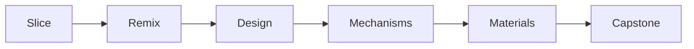

# The Learning Path — every week has code to print

This maps the whole 8-week program to hands-on sample projects, so no week is
theory-only. Do the week's sample, then remix it — that's the loop.
Part of the [Boaky Family Summer 3D Printing Program](../program/00-overview.md).
*Weird words? Check the [Decoder Ring](../program/10-glossary.md).*

The skill ladder you're climbing, one rung at a time:

## Week-by-week coverage

| Week | Theme | Skill you're building | Sample to print & remix | Who |
|---|---|---|---|---|
| 1 | Bootcamp | Slice, print, measure; first code-CAD (designing 3D shapes by writing code) | [clearance-test](family/clearance-test.scad) → find our magic gap number; [name-keychain](matt/name-keychain.scad) → first edit-a-line design | Everyone |
| 2 | Remix week | Make downloaded models *yours* | [remix-pedestal](family/remix-pedestal.scad) → `import()` any STL (the standard 3D-shape file) onto your own base with your own title | Everyone |
| 3 | Original design I | Design from scratch, iterate | [spinning-top](matt/spinning-top.scad) → change → race → change again; [parametric-building](peter/parametric-building.scad) → floors/windows/roof as rules | Matt / Peter |
| 4 | Multi-color mastery | Height-range painting, color planning | [zoning-district](peter/zoning-district.scad) → each zone is a height = one-click coloring; [photo-lithophane](family/photo-lithophane.scad) → a photo becomes thickness | Peter / Everyone |
| 5 | New materials | TPU (flex) and PETG (strength) | [squishy-ball](matt/squishy-ball.scad) → TPU airless-style ball (rear spool, not AMS!) | Matt |
| 6 | Real data & mechanisms | Joints, sliders, magnets, real maps | [gyro-fidget](matt/gyro-fidget.scad) + [ball-joint-figure](matt/ball-joint-figure.scad) → the two joints toys are made of; [magnet-coaster](family/magnet-coaster.scad) → pause-at-height embedding (get Dad); the **map→model pipeline** ([guide](peter/MAP-TO-MODEL.md)): [buildings](peter/osm-to-scad.py), [terrain](peter/terrain-to-scad.py), [streets](peter/streets-to-scad.py) | Matt / Peter / Dad |
| 7 | Capstone builds | Systems: parts that work together | [city-tile](peter/city-tile.scad) + buildings that fit its pads; [penalty-shootout](matt/penalty-shootout.scad) → goal + keeper slider + flick ramp, ready to redesign | Peter / Matt |
| 8 | Finish & showcase | Polish, photograph, publish | [skyline-generator](peter/skyline-generator.scad) → seed-controlled procedural city for the showcase shelf; publish the summer's best via Dad's account ([how](../program/04-contests-and-community.md)) | Everyone |

## The skills these samples cover, end to end

- **Slicer literacy** → every print; multi-color painting in week 4
- **Parameters & iteration** → keychain, top, building (change → render → print → measure)
- **Tolerances & moving parts** (the tiny air gap that lets printed joints move) → clearance-test → flexi-snake → gyro-fidget → ball joints
- **Systems thinking** → city-tile grid rules, penalty-shootout kit, buildings-fit-pads
- **Materials** → PLA everywhere, TPU (squishy-ball), PETG (print any sample in PETG and compare stiffness)
- **Advanced printer tricks** → height-range color (zoning map), lithophane (a photo turned into thickness that glows when backlit), pause-at-height magnets
- **Real-world data** → the map→model suite: buildings, terrain, and streets ([pipeline guide](peter/MAP-TO-MODEL.md))
- **Procedural design** → skyline-generator (seeds, randomness you can reproduce)

## How to work a sample (the loop)

1. **Print it as-is** — know what "working" looks like.
2. **Read the code top to bottom** — every file is commented for you.
3. **Change ONE parameter**, render, print, compare. Log it.
4. **Do an "IDEAS TO TRY"** from the file footer, or invent your own.
5. **Ask Claude** for the change you can't figure out — then read what changed.
6. When it's genuinely yours → photos → build log → maybe [publish](../program/04-contests-and-community.md).
