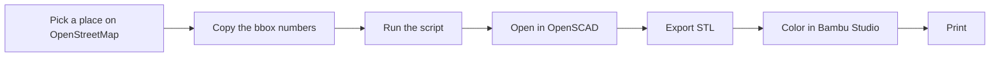

# Map → 3D Print: the complete pipeline 🗺️→🖨️

How to turn any real place on Earth into a printed model. This is Peter's
week-6 superpower, but anyone can use it (grandparents' neighborhood coaster =
best gift ever). Part of the [program](../../program/00-overview.md); the deep
track context is in [02-peter-city-studio.md](../../program/02-peter-city-studio.md).

*Weird words? Check the [Decoder Ring](../../program/10-glossary.md).*

## Pick your layer

A map is really three printable layers. We have a script for each:

| You want... | Tool | What you get |
|---|---|---|
| **Buildings** (blocks, skylines, districts) | [`osm-to-scad.py`](osm-to-scad.py) | Every building footprint (the outline where it meets the ground) in your box, extruded (stretched straight up) to its real height |
| **Terrain** (mountains, valleys, coastlines) | [`terrain-to-scad.py`](terrain-to-scad.py) | The actual shape of the land as a solid heightmap (a grid of height numbers turned into 3D land) |
| **Streets** (the map look — road networks) | [`streets-to-scad.py`](streets-to-scad.py) | Raised street ribbons on a plate, big roads wider than small ones |

All three: standard-library Python, no installs, same workflow.

## The workflow (same for all three)

Here's the whole trip from map to printer:



1. **Get a bounding box** — "bbox" for short: four numbers that fence off a
   rectangle of the Earth. Go to [openstreetmap.org](https://www.openstreetmap.org),
   find your place, click **Export** — copy the four numbers
   (south, west, north, east). Keep the box SMALL: a few blocks, not a city.
2. **Run the script** (Dad for the first time — it needs internet):
   ```
   python3 osm-to-scad.py     --bbox 40.7065,-74.0135,40.7105,-74.0085 > model.scad
   python3 terrain-to-scad.py --bbox 44.25,-71.35,44.30,-71.28 --out-dat terrain.dat > model.scad
   python3 streets-to-scad.py --bbox 40.7065,-74.0135,40.7105,-74.0085 > model.scad
   ```
3. **Open `model.scad` in OpenSCAD** (the free app that turns code into 3D
   shapes) → `F6` → export STL (the standard just-the-shape 3D print file).
   (For terrain, keep `terrain.dat` in the same folder as the .scad.)
4. **Slice in Bambu Studio.** Both the streets map and the buildings model are
   built for **height-range color painting** — floors, roads, and ground sit at
   different heights, so coloring takes one click per color.
5. Print, check the script's plate-size warning first (H2C plate ≈ 330×320mm).

## Which places make good prints

- **Buildings:** dense downtowns with height data (Manhattan is famous for
  having great OSM data — OSM is OpenStreetMap, the free world map anyone
  can edit). Suburbs = boring flat boxes.
- **Terrain:** mountains, canyons, harbors, islands. Flat places need
  `--z-exaggerate 3` to show anything. (Map makers really do exaggerate
  height — now you know why.)
- **Streets:** old cities with crooked streets look amazing; grid suburbs
  look like graph paper. Your own neighborhood is always a winner because
  *you know it*.

## Combine layers (advanced, weeks 7–8)

- Terrain + streets: run both with the **same bbox**, then in OpenSCAD
  `union()` the streets model translated on top of the terrain — `union()`
  is OpenSCAD's glue-shapes-together command — ask Claude
  to help fit the streets to the surface.
- Buildings + your own designs: generate a real block with `osm-to-scad.py`,
  then replace one real building with YOUR [parametric building](parametric-building.scad) —
  a design controlled by numbers you can change
  — "what should be built here instead?" is a real urban-planning question.

## When the scripts aren't enough (browser tools)

For photoreal whole-city chunks or fancier terrain, the web tools in
[Peter's toolbox](../../program/02-peter-city-studio.md#real-city-data-toolbox):
[Map2Model](https://www.map2model.de/), [CADmapper](https://cadmapper.com/),
and [TouchTerrain](https://touchterrain.geol.iastate.edu) do the same jobs
with more polish but less "I built this" — our scripts show you HOW it works,
which is the point.

## Troubleshooting

- **Script fails with a network error** → the free APIs (an API is how a
  program asks a website for data directly) rate-limit — they say "slow
  down" if you ask too often. Wait a minute and retry. Overpass (the service
  that answers our map questions) has an alternative mirror if it persists —
  ask Claude.
- **Empty model** → your bbox is too small or has no data; grow it slightly.
- **Model too big / slicer chokes** → raise `--scale` (buildings) or lower
  `--samples` (terrain); shrink the bbox (streets).
- **Buildings all the same height** → OSM has no height data there;
  they get `--default-levels` floors. Try a denser downtown.
